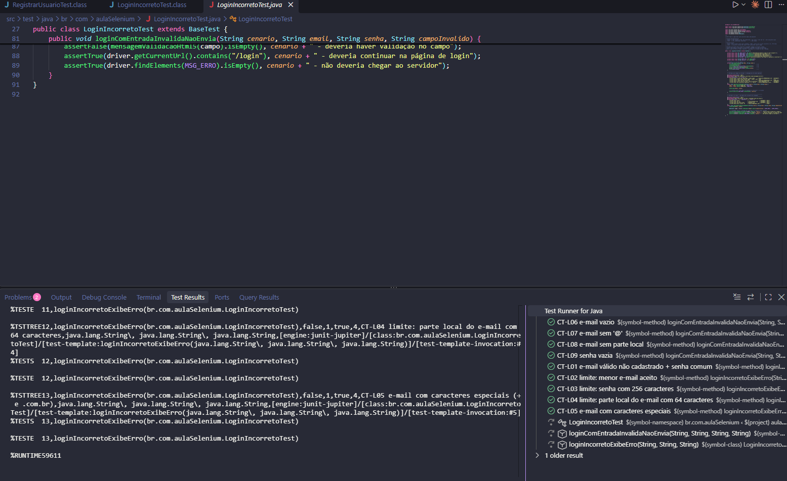
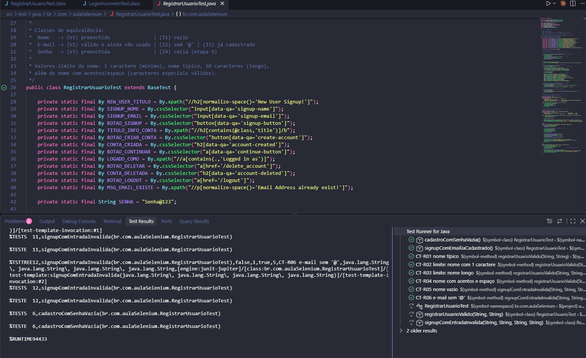

# Testes E2E com Selenium – Automation Exercise

Testes automatizados do site [automationexercise.com](https://automationexercise.com) usando **Java, Selenium, JUnit 5 e WebDriverManager**.

Funcionalidades testadas:
- **Test Case 3:** Login com e-mail e senha incorretos (`LoginIncorretoTest`)
- **Test Case 1:** Registrar usuário (`RegistrarUsuarioTest`)

## Como executar

Pré-requisitos: JDK 11+, Google Chrome e VS Code com a extensão *Extension Pack for Java*.

1. Abra a pasta do projeto no VS Code.
2. Espere o projeto Maven carregar.
3. Abra uma classe de teste e clique em **Run Test**.

## Casos de teste

Técnicas usadas: **particionamento em classes de equivalência (CE)** e **análise de valor limite (VL)**.

### Login incorreto

| ID | Técnica | Entrada | Resultado esperado |
|---|---|---|---|
| CT-L01 | CE válida | E-mail não cadastrado + senha comum | Mensagem de erro |
| CT-L02 | VL mínimo | E-mail `a@b` + senha de 1 caractere | Mensagem de erro |
| CT-L03 | VL máximo | Senha com 256 caracteres | Mensagem de erro |
| CT-L04 | VL máximo | E-mail com 64 caracteres antes do `@` | Mensagem de erro |
| CT-L05 | CE válida | E-mail com `+` e `.com.br` | Mensagem de erro |
| CT-L06 | CE inválida | E-mail vazio | Formulário não é enviado |
| CT-L07 | CE inválida | E-mail sem `@` | Formulário não é enviado |
| CT-L08 | CE inválida | E-mail sem parte antes do `@` | Formulário não é enviado |
| CT-L09 | VL (0) | Senha vazia | Formulário não é enviado |

### Registrar usuário

| ID | Técnica | Entrada | Resultado esperado |
|---|---|---|---|
| CT-R01 | CE válida | Nome típico | Conta criada e excluída |
| CT-R02 | VL mínimo | Nome com 1 caractere | Conta criada e excluída |
| CT-R03 | VL máximo | Nome com 50 caracteres | Conta criada e excluída |
| CT-R04 | CE válida | Nome com acentos | Conta criada e excluída |
| CT-R05 | VL (0) | Nome vazio | Não avança no cadastro |
| CT-R06 | CE inválida | E-mail sem `@` | Não avança no cadastro |
| CT-R07 | CE inválida | E-mail já cadastrado | Mensagem "Email Address already exist!" |
| CT-R08 | VL (0) | Senha vazia | Conta não é criada |

## Resultados

Todos os 17 testes passaram.

### Login incorreto

### Registrar usuário

